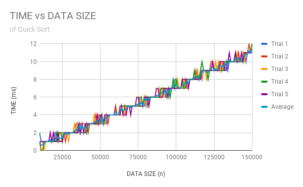

# Threeam Trash - QuickSort
### Adrian Kloskowski, Woosuk Lee, Ryan Kim
#### Background
QuickSort is a type of algorithm that sorts an array of comparable values in order. It works by implementing the partition function, which divides an array (or subarray) into three sections: a pivot value (placed at its final index), a subarray of values lesser than the partition in value and index, and a subarray of values greater than the partition in value and index. By repeating recursively on each subarray, QuickSort places each value of the array into their sorted locations.

The goal of this project is to create an implementation of QuickSort and measure its efficiency.
#### Hypothesis
* Best case: If the array is already sorted, O(n)

* Average case: O(nlogn)

* Worst case: O(n^2)
#### Experiment Methodology
To test the speed of our QuickSort implementation, we created a QuickSortTester. Using the system's millisecond clock, it randomly generates arrays of varying lengths and uses QuickSort to sort the arrays, measuring the time it takes for the method to complete. It prints out each time measurement into a csv file with each row containing a given array length followed with 5 cells of measured runtimes from 5 different tests.
#### Results

The above chart shows the results for the tests that we ran. The chart is shaped in a step function (probably because of lack of accuracy in the digits). The runtime was vacillating up and down, but generally it was increasing. The graph for average time was also showing a rather linear trend.

#### Conclusions

The chart appears to imply a constant time trend line. As the size of the randomly generated arrays increases, the time needed to sort the array increases linearly. With only one exception, the deviation of each test case from the mean of the raw data of a given array size never seems to exceed 1 millisecond, which is the minimum amount of non-zero measurable time. This is an excellent metric of the algorithm's reliability. We conclude that runtime is only negligibly affected by the arrangement of the items in an array before the function is called. Therefore, the only meaningfully significant value in determining runtime is the length of the array.
