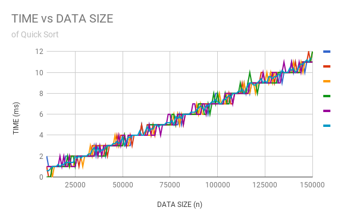

# Threeam Trash - QuickSort
### Adrian Kloskowski, Woosuk Lee, Ryan Kim
#### Background
QuickSort is a type of algorithm that sorts an array of comparable values in order. It works by implementing the partition function, which divides an array (or subarray) into three sections: a pivot value (placed at its final index), a subarray of values lesser than the partition in value and index, and a subarray of values greater than the partition in value and index. By repeating recursively on each subarray, QuickSort places each value of the array into their sorted locations.

The goal of this project is to create an implementation of QuickSort and measure its efficiency.
#### Hypothesis
* Best case: If the array is already sorted, O(n)

* Average case: O(nlogn)

* Worst case: O(n^2)
#### Experiment Methodology
To test the speed of our QuickSort implementation, we created a QuickSortTester. Using the system's millisecond clock, it randomly generates arrays of varying lengths and uses QuickSort to sort the arrays, measuring the time it takes for the method to complete. It prints out each time measurement into a csv file with each row containing a given array length followed with 5 cells of measured runtimes from 5 different tests.
#### Results

#### Conclusions
